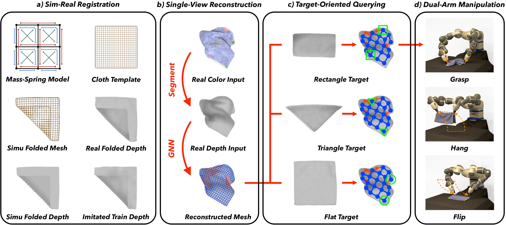
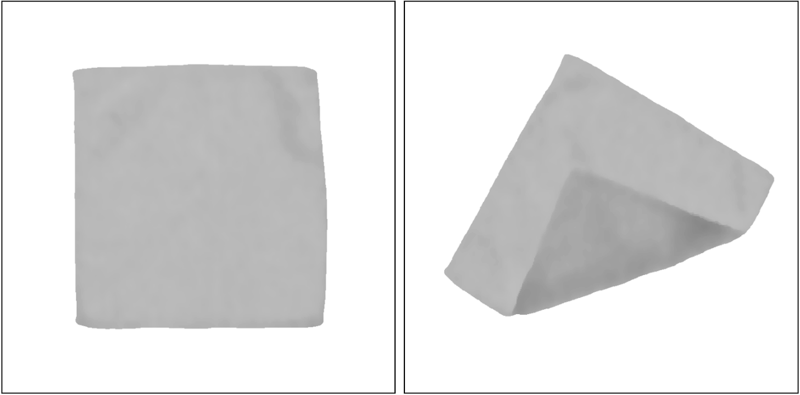

# <p align="center">TRTM: Template-based Reconstruction and Target-oriented Manipulation of Crumpled Cloths </p>

### <p align="center"> [Wenbo Wang](https://wenbwa.github.io), [Gen Li](https://vlg.inf.ethz.ch/team/Gen-Li.html), [Miguel Zamora](), [Stelian Coros](https://crl.ethz.ch/people/coros/index.html)</p>

### <p align="center"> Department of Computer Science, ETH Zurich
### <p align="center"> ICRA 2024

### <p align="center">[ArXiv](https://arxiv.org/abs/2308.04670) | [Website](https://wenbwa.github.io/TRTM/) | [Dataset](https://drive.google.com/drive/folders/19MV4ChIldysWknEQz-S2DIjdfeMIF4Ls?usp=sharing)

<p align="center">
  
</p>
  Precise reconstruction and manipulation of the crumpled cloths is challenging due to the high dimensionality of cloth models, as well as the limited observation at self-occluded regions. We leverage the recent progress in the field of single-view human reconstruction to template-based reconstruct crumpled cloths from their top-view depth observations only, with our proposed sim-real registration protocols. In contrast to previous implicit cloth representations, our reconstruction mesh explicitly describes the positions and visibilities of the entire cloth mesh vertices, enabling more efficient dual-arm and single-arm target-oriented manipulations. Experiments demonstrate that our TRTM system can be applied to daily cloths that have similar topologies as our template mesh, but with different shapes, sizes, patterns, and physical properties.
</p>

## Released
- [x] Code and model for training and testing.
- [x] Full-size synthetic dataset for retraining.
- [ ] Full-size real-world dataset for testing.
- [ ] Blender files for generating synthetic data.

## Installation
Git clone this repo:
```
git clone -b main --single-branch https://github.com/WenbWa/TRTM.git
cd TRTM
```
Init conda environment:
```
conda create -n TRTM python=3.8
conda activate TRTM
```
Install python packages:
```
bash env_install.sh
```
## Download Dataset
TRTM dataset structure:
```
datasets
└── cloth_name
    ├── real
    |   ├── test/train
    |   |   ├── {:06d}.real_depth.png
    |   └── └── {:06d}.real_color.png
    |   └── └── {:06d}.real_keypoint.txt
    ├── simu
    |   ├── test/train/val
    |   |   ├── {:06d}.simu_depth.png
    └── └── └── {:06d}.simu_mesh.txt
```

Download TRTM dataset from [here](https://drive.google.com/drive/folders/19MV4ChIldysWknEQz-S2DIjdfeMIF4Ls?usp=sharing) and place it into 'TRTM/datasets'.

Download TRTM checkpoint from [here](https://drive.google.com/drive/folders/19MV4ChIldysWknEQz-S2DIjdfeMIF4Ls?usp=sharing) and place it into 'TRTM/checkpoints'.

## Training and Testing
Train Cloth-GNN Model on template_square, use_simu only, and save to 'checkpoints/exp_train_half':
```
python main.py --phase train --cloth_name template_square --use_simu True
```
Test Cloth-GNN Model on template_square, use_real only, and from 'checkpoints/checkpoint_large_size.pt':
```
python main.py --phase test --cloth_name template_square --use_real True
```
Test Cloth-GNN Model on other_clothes named as smaller_square, larger_square, rectangle, or shirt:
```
python main.py --phase test --cloth_name other_clothes --use_real True
```

## Introduce your Own Testing Data
Step1: centralize and normalize your cloth depth images according to the following configurations (see datasets):

image_size: 720x720, flat_cloth_size: 480x480, flat_pixel_value: 190~195, 1cm_depth_pixel_value: 20.
<p align="center">
  
</p>

Step2: create your_cloth_name and place your depth images into 'TRTM/datasets/your_cloth_name/real/test/'.

Step3: test Cloth-GNN Model on your cloth images using 'checkpoints/checkpoint_large_size.pt'.
```
python main.py --phase test --cloth_name your_cloth_name --use_real True
```

## Introduce your Own Training Data (Coming Soon)
You can modify the blender files to generate new template mesh and training data.

## Reference
Convolutional Mesh Regression for Single-Image Human Shape Reconstruction: https://arxiv.org/abs/1905.03244.

LEARNING MESH-BASED SIMULATION WITH GRAPH NETWORKS: https://arxiv.org/pdf/2010.03409.pdf

Implementation of meshgraphnets: https://github.com/wwMark/meshgraphnets

Li Gen's semester project: https://github.com/ligengen/TRTM


## Citation
```
@article{wang2023trtm, 
 title={TRTM: Template-based Reconstruction and Target-oriented Manipulation of Crumpled Cloths}, 
 authors={Wenbo Wang and Gen Li and Miguel Zamora and Stelian Coros}, 
 booktitle={IEEE International Conference on Robotics and Automation (ICRA)},
 year={2024}
}
```


